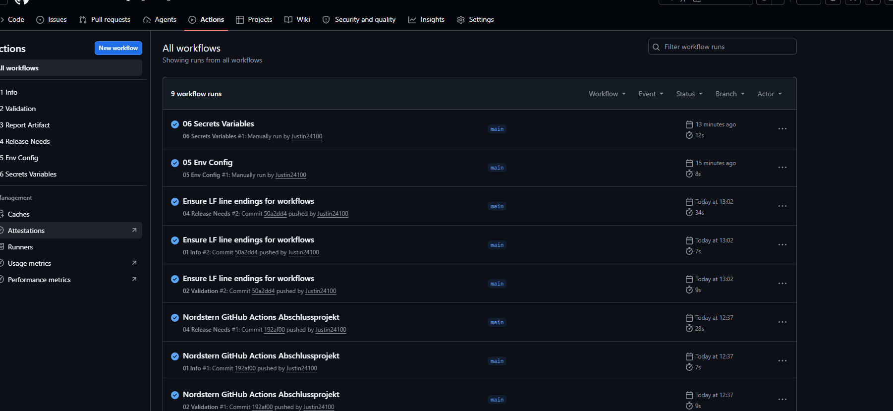
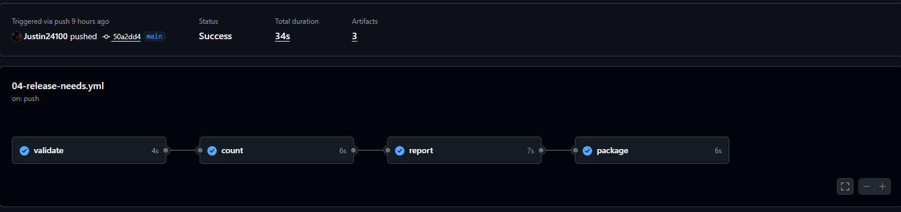
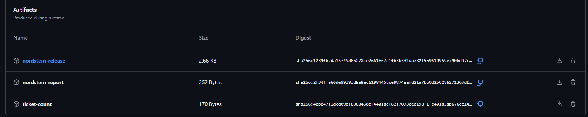
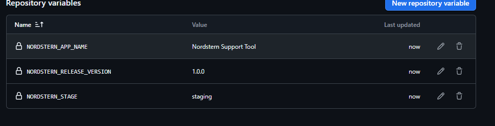
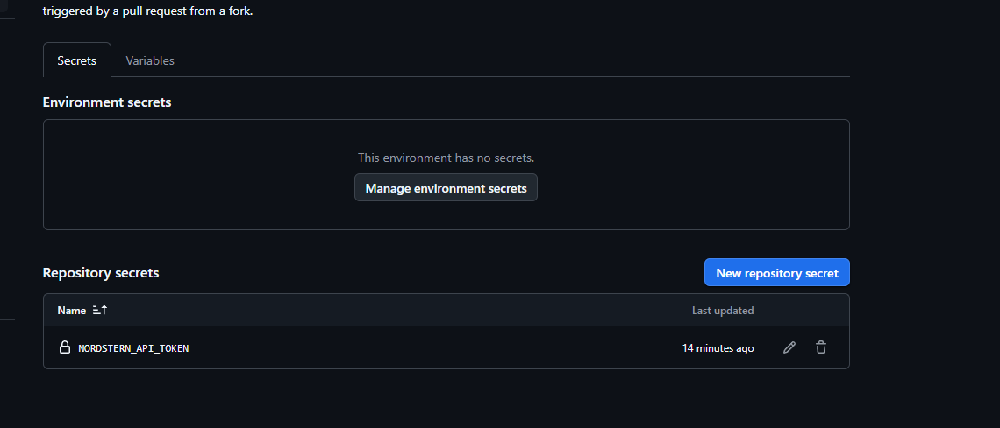

# Nordstern GmbH: GitHub Actions Abschlussprojekt

Dies ist das Projekt zur Abschlussaufgabe.

Die Bash Skripte sind bereits vorbereitet. Die Teilnehmer sollen selbst die GitHub Actions Workflow Dateien erstellen.

## Szenario

Du arbeitest bei der Nordstern GmbH im DevOps Team. Die Firma nutzt ein kleines internes Bash Projekt, um Support Tickets auszuwerten, Reports zu erstellen und ein Release Paket zu bauen.

Deine Aufgabe ist es, für dieses Projekt mehrere GitHub Actions Pipelines zu erstellen.

## Projektstruktur

```text
nordstern-github-actions-abschlussprojekt/
├── .github/
│   └── workflows/
│       └── .gitkeep
├── config/
│   └── app.conf
├── data/
│   └── tickets.csv
├── scripts/
│   ├── 01_show_info.sh
│   ├── 02_validate_project.sh
│   ├── 03_count_tickets.sh
│   ├── 04_create_report.sh
│   ├── 05_package_release.sh
│   ├── 06_env_config.sh
│   └── 07_secret_check.sh
└── README.md
```

## Lokal testen

Im Projektordner ausführen:

```bash
chmod +x scripts/*.sh
bash scripts/01_show_info.sh
bash scripts/02_validate_project.sh
bash scripts/03_count_tickets.sh
bash scripts/04_create_report.sh
bash scripts/05_package_release.sh
CUSTOMER_NAME="Nordstern GmbH" DEPLOY_ENV="staging" RELEASE_VERSION="1.0.0" bash scripts/06_env_config.sh
NORDSTERN_API_TOKEN="test-token-123" bash scripts/07_secret_check.sh
```

## Aufgabe

Erstelle im Ordner `.github/workflows/` mehrere YAML Dateien. Die genaue Aufgabenstellung steht im Word Dokument.

## Abgabe Screenshots

### Actions Übersicht



### Release Pipeline mit mehreren Jobs



### Release Artefakte



### Repository Variables



### Repository Secret


